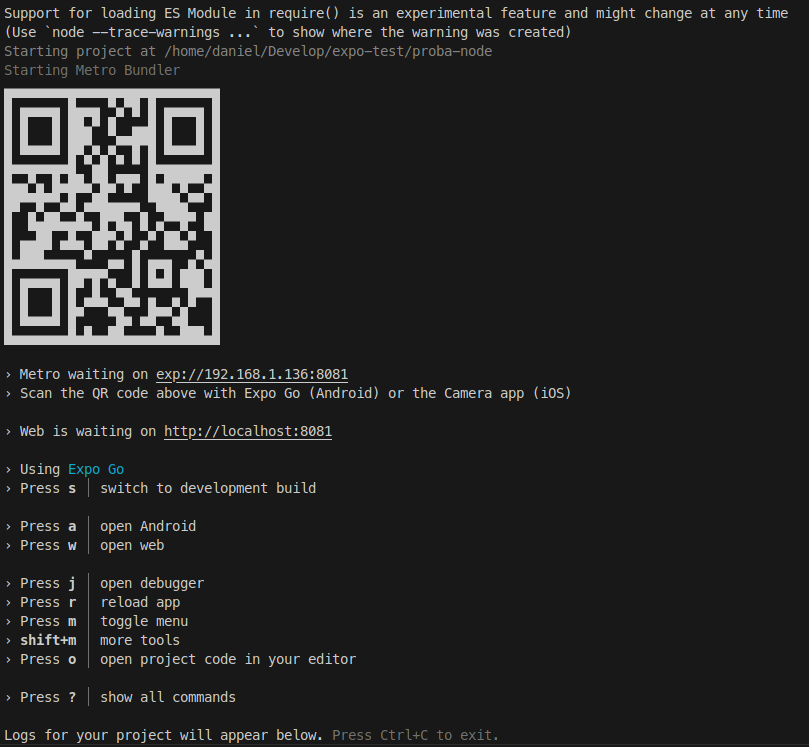

# Proba de concepto con React Native - Expo

## Node

### Instalar Node.

### Crear o proxecto:

```
npx create-expo-app proba-node
```

### Probar o proxecto:

```
cd proba-node
npx expo start
```

Aparece o menú coas ferramentas para ver a aplicación de proba no navegador ou no teléfono empregando [Expo Go](https://play.google.com/store/apps/details?id=host.exp.exponent&hl=es_419)



### Partir dun boilderplate mínimo.

Limpamos a aplicación de probas para iniciar unha desde un boilderplate mínimo.

Detemos a aplicación pulsando `Ctrl+C`

```
npm run reset-project
```

Contestamos `y` á pregunta de confirmación.

### Documentacion de componentes proporcioinados

A [documetación sobre os compoñentes nativos proporcionados](https://reactnative.dev/docs/components-and-apis) por React Native é bastante clara.
 